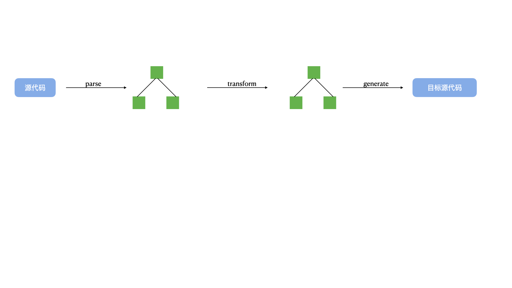

<!--
 * @Desc: 简介
 * @FilePath: /tutor-babel/docs/md/guide.md
 * @Author: liujianwei1
 * @Date: 2021-05-14 13:35:27
 * @LastEditors: liujianwei1
 * @Reference Desc: 
-->
```bash
Babel is a JavaScript compiler.
```
Babel是一个Javascript编译器 


### 为什么要编译
究其原因，前端语言特性(esnext、typescript、flow等)和宿主环境(浏览器/Node.js)高速发展，宿主环境无法及时支持新的语言特性。因此，需要把新的语言特性降级处理，转换成目标环境支持的语法，并且对目标环境不支持的API添加Polyfill 

Babel对代码降级处理，可以概括为两部分：
- **语法转换**——例如：箭头函数语法、async函数语法、class定义类语法、解构赋值等。
- **补齐新的API**——例如：`Array.prototype.includes`,`String.prorotype.includes`,`Promise`、`Map`、`Symbol`等

### Babel的编译流程

Babel是`源代码`到`目标环境源代码`的转换，仍然是高级语言到高级语言的转换，整个过程可分为三个阶段：
- 解析（parse）—— 通过`@babel/parser`把源代码字符串转成抽象语法树(AST)
- 转换（transform）——通过`@babel/traverse`遍历抽象语法树(AST),并调用Babel配置文件中的插件,对抽象语法树(AST)进行增删改
- 生成（generate）——通过`@babel/generator`把转换后的抽象语法书(AST)生成目标代码



如何书写Babel的配置文件，产出最优的编译结果？


